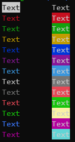

# termcolors
Simple and lightweight package for coloring text in the CLI

# Usage
```python
import termcolors

print(termcolors.text.red + "Red text " + termcolors.background.pink + " on pink bg" + termcolors.reset)
# or
print(termcolors.colorize("{{text_red}}Red text {{bg_pink}}on pink bg"))
```

# Colors
Color `reset` resets all previous color settings

Name | Text | Background
-----|:------:|:-----------:
black | + | +
red | + | +
green | + | +
yellow | + | +
blue | + | +
purple | + | +
sky | + | +
gray | + | +
corral | + | +
light_green | + | +
light_yellow | + | +
pink | + | +
cyan | + | +



# Install
Run:
```bash
pip install git+https://github.com/AlexBrin/termcolors
```